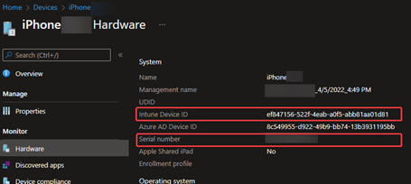
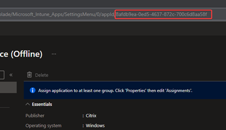

#### Table of Contents
1. [General](#Opening-quality-Support-cases-for-Intune)
2. [How to find technical details](#finding-technical-detail)
3. [Required info for all cases](#required-for-all-cases)
4. [App Protection Policies](app.md)
5. [Autopilot](autopilot.md)
6. [Windows](windows.md)
7. [Android](android.md)
8. [iOS/macOS/Apple](apple.md)
9. [Portal/Reporting](portal.md)

# Opening quality Support cases for Intune

*The purpose of this guide is to provide guidance on how to open up great support cases. 
This will minimize case resolution time, reduce back & forth communications and progress you further into the case from the beginning.*

Please use the table of contents to skip around this guide as needed.

Additionally, please remember this is not a troubleshooting guide, but rather a guide on opening up high quality cases.
It will also not contain everything in the scope of Intune - this is just a high-level guide of what to submit for the majority of cases. 

***

# Required for all cases

Each case has a few **mandatory** things from a high level we will cover:
 
1. The problem
2. The scope of the problem
3. Business Impact

We will cover all of these in-depth.

## The problem

What is the problem at hand? Be clear and concise - here are some examples.
* App deployment
* Device Enrollment
* Configuration Policy
* Resource Access (VPN, Wi-Fi)
* Portal behavior / reporting issues

***

Now that we have the basics out of the way – let’s dive into technical information to include in the case.

**Please try to include this information in every case if possible**

* What platform is affected? (iOS, Windows, Android)
* Is this a policy deployment issue? 
    * If so – what kind of policy? App Protection Policy? SCEP? VPN?
    * Please include the exact name of the policy in the case.
* Is there currently an affected device that we can actively use to troubleshoot? 
* What is the User Principal Name (UPN) of the user who is using it?
* What is the Intune DeviceId? (Navigate to the device in the Intune Portal, and click on “Hardware”)
* What is the device serial number?
* How many users are affected? How ma-ny devices?
* Does this affect the same user on other devices?

Once you have these basics included, you should include the below information as well (where applicable)

[For guidance on  the technical details, click here](#finding-technical-detail). 

Once you have these basics established, 

### Finding technical detail

- Devices
    - Serial Number 
    - Device Id. 
    These can be found under the “Hardware” tab
    - 
- Users
    - User Principal Name (e.g., user@domain.com)
- Applications
    - The exact name of the application & the platform (e.g., iOS, Windows, Win32, MSI, etc.).
    - Application ID – found in the URL when you open an app:
    - 
- Policies
- We just need the *exact name of the policy.*

---